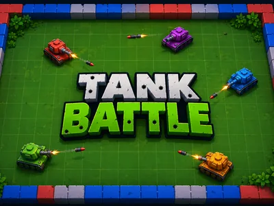
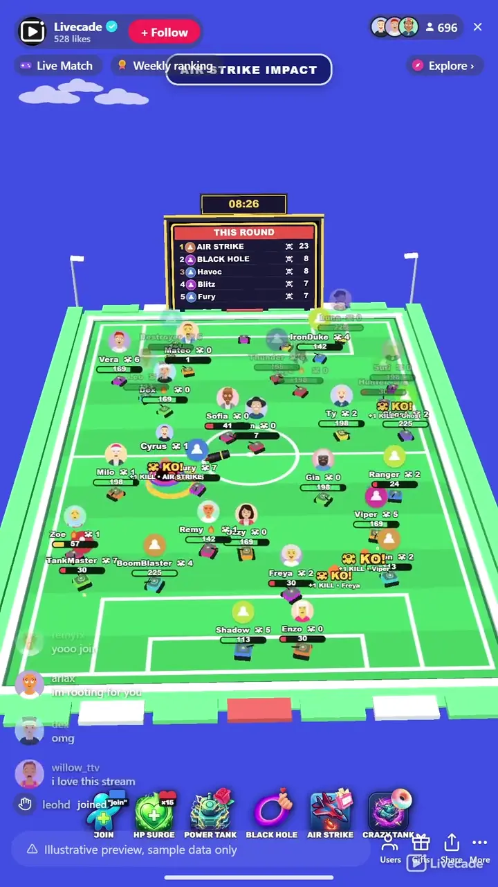

# Tank Battle - Interactive TikTok Live Game

> Up to 150 viewer tanks fighting at once, with air strikes and black holes dropped in by chat.

Your viewers each claim a tank and the whole pitch fights at once, up to 150 of them. Nobody drives: the tanks pick their own targets, and gifts drop air strikes, black holes and power-ups into the middle of it.

**[Play Tank Battle on Livecade](https://livecade.io/games/tank-battle/?utm_source=github&utm_medium=readme&utm_campaign=tank-battle)** - runs as a single browser source in OBS, Streamlabs, or TikTok LIVE Studio. Nothing for viewers to install.

## How viewers play

Viewers take part with the actions TikTok already gives them: **gifts**, **comments**, **likes**, **follows**, **shares**. Every action below is rebindable, so you decide which interaction drives which effect.

| Action | What it does |
| --- | --- |
| **Join Battle** | Puts a tank with the viewer's name on the pitch. Bound to the comment "join" by default, and a full pitch retires a bot rather than turning them away |
| **HP Surge** | Multiplies the sender's tank health and visibly grows it. Uncapped, so repeat triggers push it into the thousands. Bound to likes by default, so it costs nothing to use |
| **Power Tank** | Shields the sender's tank and cuts the camera to it. Repeat sends extend the shield rather than replacing it |
| **Black Hole** | Opens a vortex on the pitch that drags nearby tanks in and destroys them. Carries the sender's name while it lives |
| **Air Strike** | Flies an aircraft across the field dropping a rolling carpet of bombs. Several at once fly separate lanes as a formation |
| **Crazy Tank** | Sends the sender's tank spinning and firing wildly for a short burst. The most damaging effect in the game, and deliberately brief |

## How it works

### One comment gets a tank

A viewer types "join" and a tank carrying their name rolls onto the pitch. It picks its own targets and fights without any input from them or from you. Sending a gift also gets a tank, so an effect always has somewhere to land.

### Five effects, all of them visible

HP Surge multiplies a tank's health and grows it on screen. Power Tank shields it. Crazy Tank sends it berserk for a short burst. Air Strike flies a bombing run across the field, and Black Hole opens a vortex that pulls tanks in. The last two hit whoever is nearby, not just the sender.

### Death costs a few seconds, not the round

Tanks respawn after a delay you set, and a viewer keeps their kills and their gifted HP through it. Scores reset when a round ends, so a new arrival is never looking at an unreachable leaderboard.

### The camera cuts to the good part

Close-ups fire on gifted effects, on two badly damaged tanks fighting it out, and on the last tank standing, so the moment a viewer paid for is the one filling the screen.

## About the game

Tank Battle is an all-out auto-battle on a floodlit stadium pitch. A viewer types "join" and a tank with their name on it rolls out. From there it fights on its own, hunting targets and taking fire, and nobody has controls, so the battle runs for as long as you leave it running.

### Gifts are things that happen to the pitch

The five effects are not score multipliers. An air strike is an aircraft that flies a lane across the field and carpets it with bombs. A black hole is a vortex that opens somewhere on the grass and drags tanks into it. HP Surge multiplies a tank's health and visibly grows it, Power Tank shields it, and Crazy Tank sends it spinning and firing wildly for a short burst. Whoever sent it has their name on the effect while it plays out.

### Bulk sends stack instead of being wasted

Sending ten of a gift at once is ten times the effect, not one. Ten roses is ten times the Power Tank shield, and ten air strikes launch as a formation of aircraft flying separate lanes rather than one plane. Bulk sending is the loudest thing that happens on the pitch, which is the point.

### It never sits empty

Bots fill the pitch up to a floor you set so a quiet stream still has a battle on screen, and they hand their slot over the moment a real viewer joins, so a bot never costs anyone a place. Tanks respawn a few seconds after they die, keeping the kills and the gifted HP they earned, so nobody is ever out of your stream for good.

## What it looks like on stream

[Watch Tank Battle gameplay](https://cdn.livecade.io/games/tank-battle.mp4)

## What you can configure

- **Interface language** - Twelve languages for the on-screen chrome
- **Battle intensity** - One dial from relaxed to carnage, setting fire rate, tank speed, shell speed and toughness together
- **Round mode** - A countdown round, ten minutes by default, or an infinite battle that never ends
- **Max tanks on pitch** - Up to 150 viewers and bots together, 60 by default. The biggest driver of load, since the server simulates every tank
- **Fill with bots up to** - Keeps a floor of tanks fighting when the live is quiet, 24 by default. Bots give up their slot to real viewers
- **Respawn delay** - How long a dead tank waits before it rolls back out, three seconds by default
- **Leaderboard screen** - How long the final scores hold before the next round starts, ten seconds by default
- **Cinematic close-ups** - Cuts in close on gifted effects, near-death duels and the last tank standing
- **Random special events** - Fires a free air strike, black hole or power-up every 9 to 18 seconds so a quiet chat still gets a show

## Languages

English, Spanish, Portuguese, French, German, Italian, Indonesian, Arabic, Turkish, Russian, Hindi, Romanian

## FAQ

<strong>How do viewers join Tank Battle?</strong>

They type "join" in chat and a tank with their name on it rolls onto the pitch. That is the default and you can change it to any comment, a gift, a follow, a like or a share. Sending any gift also puts a viewer in, so nobody pays for an effect and has nowhere to put it.

<strong>Do viewers drive their own tanks?</strong>

No, and that is what lets the game run a whole stream. Tanks pick their own targets and fight on their own. What a viewer controls is what lands on the pitch: joining, and the five effects they can trigger.

<strong>How many tanks can be fighting at once?</strong>

Up to 150, with 60 as the default. Every tank is simulated on our server rather than in your browser, so the ceiling is a real one. Raising it is the single biggest thing you can do to increase load, which is why the default sits well below the maximum.

<strong>What happens when a viewer's tank is destroyed?</strong>

It comes back after a few seconds, three by default, and it keeps the kills and the gifted HP it had. Nobody is knocked out of your stream for good. Scores reset at the end of a round so the leaderboard stays winnable for someone who just arrived.

<strong>What do gifts actually do?</strong>

Five things, and all of them are visible on the pitch rather than a number going up: an air strike bombing run, a black hole that swallows tanks, a health surge that grows a tank, a shield, and a berserk mode. It ships bound to cheap gifts viewers actually send, with the health surge on likes so it is free, and every binding is yours to change.

<strong>Does sending ten of a gift do ten times as much?</strong>

Yes. Bulk sends stack rather than collapsing into one hit, so ten roses is ten times the shield and ten air strikes launch as a formation flying separate lanes. Effects arrive as the viewer sends them rather than all at the end.

<strong>What if my chat is quiet?</strong>

Bots fill the pitch up to a floor you set, 24 by default, so there is always a battle on screen, and they step aside the moment a real viewer joins. Random special events also fire a free air strike, black hole or power-up every 9 to 18 seconds, and you can switch both off.

<strong>Can I change the music?</strong>

Yes. Tank Battle uses the live music deck, so the soundtrack is on the MUSIC tab and you can replace it with anything in your library mid-stream. Leaving it alone keeps the track it ships with.

<strong>How do I add Tank Battle to my TikTok Live?</strong>

Add one browser source URL to OBS or your streaming software and go live. There is no plugin to install and nothing for your viewers to download.

## Setup

1. [Create a Livecade account](https://app.livecade.io/register?utm_source=github&utm_medium=cta&utm_campaign=tank-battle)
2. Copy your overlay browser source URL
3. Paste it into OBS, Streamlabs, or TikTok LIVE Studio
4. Pick Tank Battle, set your triggers, and go live

Runs in the browser, so it works on Windows and macOS with nothing to download. [See all TikTok Live games](https://livecade.io/tiktok-live-games/?utm_source=github&utm_medium=readme&utm_campaign=tank-battle).

---

_This repository documents Tank Battle, a hosted interactive game by [Livecade](https://livecade.io/?utm_source=github&utm_medium=footer&utm_campaign=tank-battle). The game runs on Livecade's platform, so there is no source to install here._
